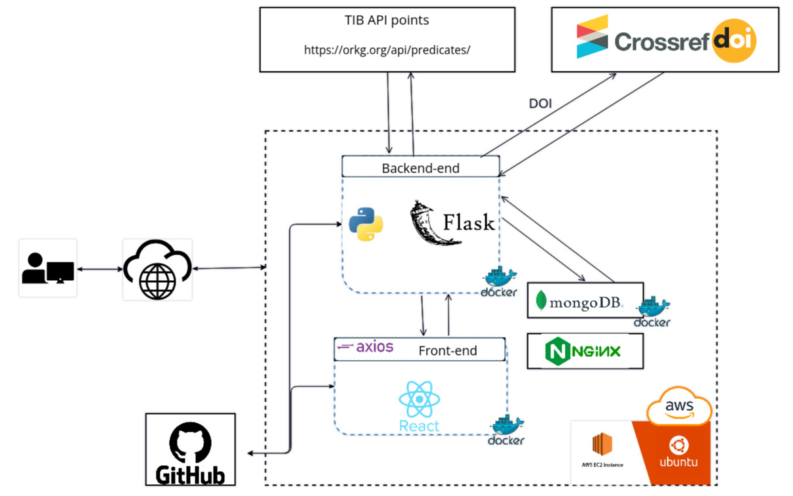
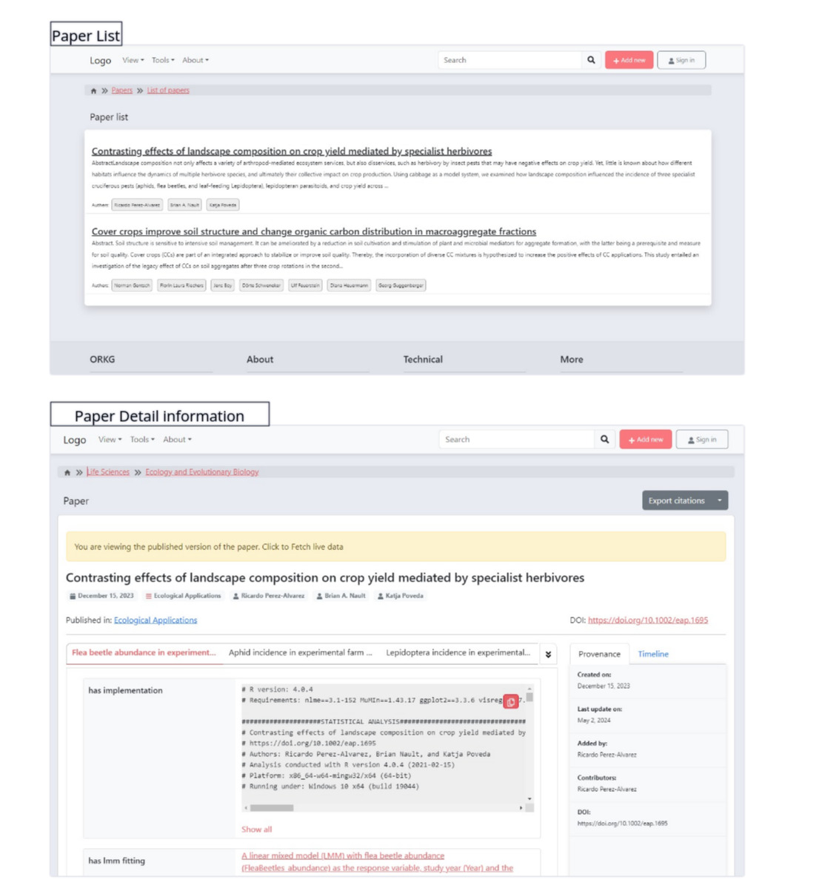

## Introduction
This repository details the development of the React-based application for extracting and displaying paper-related data from nested JSON structures.
The data is extracted from  [TIB APIs](https://orkg.org/api/predicates/) to present the scholar data that have inclusion dependencies.  This solution tries to address the challenge of presenting nested JSON data by utilizing React/Flask/Nginx/MongoDB technologies.  The Figure below illustrates the big picture and screenshots.

  - [Installation](#installation)
  - [MongoD](#1-mongodb)
  - [Backend](#2-backend)
  - [Frontend](#3-frontend)
  - [Initiating Database](#4-initiating)
- [Note](#note)


## Installation
To deploy the application in the target environments, apart from installation requirements,  there is required to apply some changes in config files to set up the application to the target environment. These main steps are required which will be described in detail:

#### Cloning the current repository

```
git clone https://github.com/HadiQaemi/TIB_task.git
```

#### 1-MongoDB
To store extracted data, MongoDB is used as the database. For simplified management and isolation, a MongoDB Docker container is utilized.
```
sudo docker ps
sudo docker inspect <container id> | grep "IPAddress"
```

To assign an internal IP address, use the following command to obtain the IP address of the running MongoDB container, which can then be used for MongoDB connections.

```
# List lists all running Docker containers info (e.g., containerID, status)
sudo docker ps

# This command inspects a specific Docker container and extracts its IP address.
sudo docker inspect <containerID> | grep "IPAddress"
> output <MongoDB IP Address>
```

Then, we need to add this <MongoDB IP Address> to the MONGO_URI in the "/backend/config.py" file.
```
cd backend/ 
nano config.py
> modify: MONGO_URI = "mongodb://<MongoDB IP Address>:27017"
```


#### 2-Backend

The backend, implemented using Flask, is responsible for retrieving nested JSON data containing paper information and interacting with the MongoDB database. The related code is located in the ./backend folder of this repository. To provide interactive API documentation, a Swagger interface is utilized, accessible at http://<hostname>:5000. For the current deployment, the URL is http://18.135.29.147:5000/. The following command illustrate backend installation using Dockerfile:
```
sudo docker build -t python-backend .
sudo docker run -d -p 5000:5000 python-backend
```
#### 3-Frontend
Frontend is utilizing React and provides two pages, which the first one shows a list of papers, and the second page presents the paper's nested information in detail.
- [Paper List page](http://18.135.29.147:3000)
- [Requested Paper deatils](http://18.135.29.147:3000/paper/R689181/)
```
cd frontend/
nano .env
> Modify this line	REACT_APP_API_URL= http://SERVER:PORT
```
Afterward build and run docker using Dockerfile in the frontend directory
```
sudo docker build -t react-front .
sudo docker run -d -p 3000:80 react-front
```

#### 4-Initiating
 As described in the [Swagger documentation ](http://18.135.29.147:5000) at http:<hostserver>/add-paper, needs to be called to initialize the database.
 This API help to scrab and download information of papers to MongoDB.



# Note
- The interface is designed based on The Open Research Knowledge Graph.(https://orkg.org/).
- Given the public nature of the data and its lower sensitivity, I prioritized to focus on development and deployment. As a result, the application is currently running over HTTP and has not yet been migrated to HTTPS, and might affect to accessing the application on high restricted networks.
